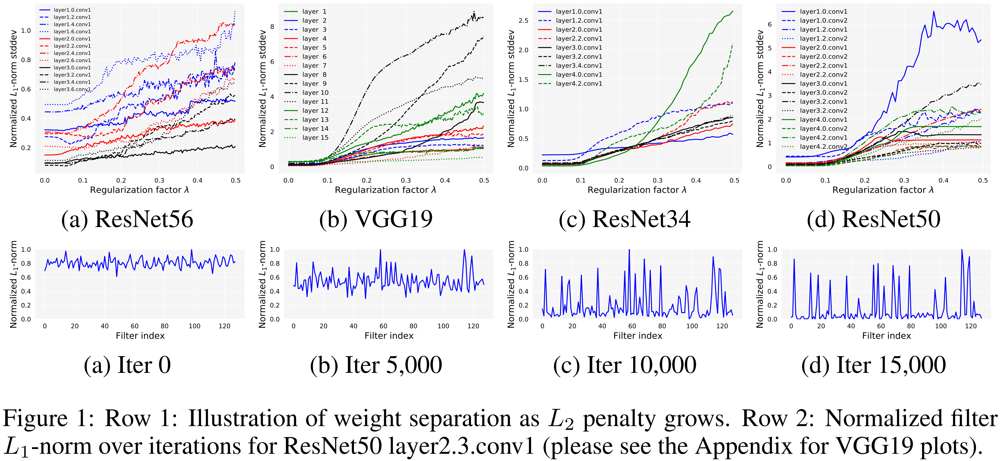
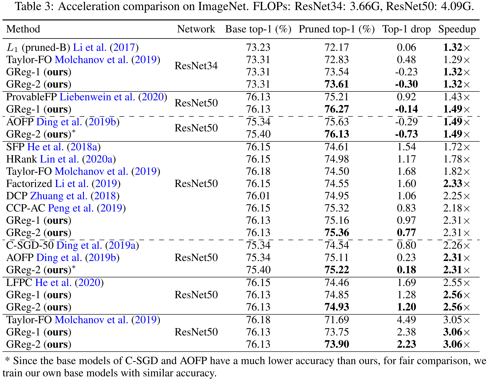
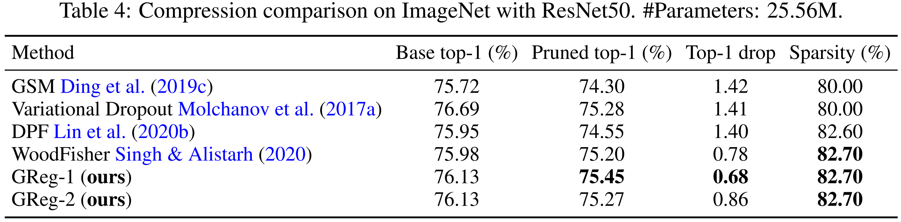

# Regularization-Pruning

This repository is for the new deep neural network pruning methods introduced in the following paper:
> **Neural Pruning via Growing Regularization [[arxiv](https://arxiv.org/abs/2012.09243)]** \
> [Huan Wang](http://huanwang.tech/), [Can Qin](http://canqin.tech/), [Yulun Zhang](http://yulunzhang.com/), and [Yun Fu](http://www1.ece.neu.edu/~yunfu/) \
> Northeastern University, Boston, MA, USA

TLDR: This paper introduces two new neural network pruning methods (named `GReg-1` and `GReg-2`) based on uniformly growing (L2) regularization:
- `GReg-1` is simply a variant of [magnitude pruning](https://arxiv.org/abs/1608.08710) (i.e., unimportant weights are decided by magnitude sorting). We utilize growing regularition to drive the unimportant weights to zero before evetually removing them.
- `GReg-2` seeks to exploit the Hessian information for more accurate pruning *without Hessian approximation* (which is usually intractable for modern deep nets). The point is that we find with the uniformly growing regularization, how the weights respond can reflect their underlying curvature landscapes, which will ultimately lead to weight seperation in terms of their magnitude (shown in the figure below). When the magnitude gap is large enough, we can faithfully prune them simply by magnitude.
<center></center>


## Step 1: Set up environment
- OS: Linux (Ubuntu 1404 and 1604 checked. It should be all right for most linux platforms. Windows and MacOS not checked.)
- python=3.6.9 (conda to manage environment is strongly suggested)
- All the dependant libraries are summarized in `requirements.txt`. Simply install them by `pip install -r requirements.txt`.
- CUDA and cuDNN

After the installlations, download the code:
```
git clone git@github.com:MingSun-Tse/Regularization-Pruning.git -b master
```

## Step 2: Set up dataset
- We evaluate our methods on CIFAR and ImageNet. CIFAR will be automatically downloaded during training.
- For ImageNet, prepare it following the official [pytorch imagenet example](https://github.com/pytorch/examples/tree/master/imagenet).


## Setp 3: Set up pretrained (unpruned) models
- For ImageNet, we use the official [torchvision models](https://pytorch.org/docs/stable/torchvision/models.html) for fair comparison with other approaches. The pretrained models will be automatically downloaded during training.
- For CIFAR datasets, we train our own models with comparable accuracies with their original papers:
```
# ResNet56, CIFAR10
CUDA_VISIBLE_DEVICES=0 python main.py --arch resnet56 --dataset cifar10 --method L1 --stage_pr [0,0,0,0,0] --batch_size 256 --wd 0.0005 --lr_ft 0:0.1,100:0.01,150:0.001 --epochs 200 --project scratch__resnet56__cifar10

# VGG19, CIFAR100
CUDA_VISIBLE_DEVICES=0 python main.py --arch vgg19 --dataset cifar100 --method L1 --stage_pr [0-18:0] --batch_size 256 --wd 0.0005 --project scratch__vgg19__cifar100
```
where `--method` indicates the pruning method; `--stage_pr` is used to indicate the layer-wise pruning ratio (since we train the *unpruned* model here, `stage_pr` is zero); `--lr_ft` means learning rate schedule during finetuning.

## Step 4: Training (pruning)
We use the following snippets to obtain the results on ImageNet (Table 3 and 4 in our paper).

- filter pruning, ResNet34, speedup=1.32x:
```
# GReg-1
CUDA_VISIBLE_DEVICES=0,1 python main.py --dataset imagenet --arch resnet34 --pretrained --method GReg-1 --screen --stage_pr [0,0.5,0.6,0.4,0,0] --skip_layers [1.0,2.0,2.3,3.0,3.5] --project GReg-1__resnet34__imagenet__1.32x_pr0.50.60.4

# GReg-2
CUDA_VISIBLE_DEVICES=0,1 python main.py --dataset imagenet --arch resnet34 --pretrained --method GReg-2 --screen --stage_pr [0,0.5,0.6,0.4,0,0] --skip_layers [1.0,2.0,2.3,3.0,3.5] --project GReg-2__resnet34__imagenet__1.32x_pr0.50.60.4
```

- filter pruning, ResNet50, speedup=1.49x:
```
# GReg-1
CUDA_VISIBLE_DEVICES=0,1 python main.py --dataset imagenet --arch resnet50 --pretrained --method GReg-1 --screen --stage_pr [0,0.3,0.3,0.3,0.14,0] --project GReg-1__resnet50__imagenet__1.49x_pr0.30.14

# GReg-2
CUDA_VISIBLE_DEVICES=0,1 python main.py --dataset imagenet --arch resnet50 --pretrained --method GReg-2 --screen --stage_pr [0,0.3,0.3,0.3,0.14,0] --project GReg-2__resnet50__imagenet__1.49x_pr0.30.14
```

- filter pruning, ResNet50, speedup=2.31x:
```
# GReg-1
CUDA_VISIBLE_DEVICES=0,1 python main.py --dataset imagenet --arch resnet50 --pretrained --method GReg-1 --screen --stage_pr [0,0.6,0.6,0.6,0.21,0] --project GReg-1__resnet50__imagenet__2.31x_pr0.60.21

# GReg-2
CUDA_VISIBLE_DEVICES=0,1 python main.py --dataset imagenet --arch resnet50 --pretrained --method GReg-2 --screen --stage_pr [0,0.6,0.6,0.6,0.21,0] --project GReg-2__resnet50__imagenet__2.31x_pr0.60.21
```

- filter pruning, ResNet50, speedup=2.56x:
```
# GReg-1
CUDA_VISIBLE_DEVICES=0,1 python main.py --dataset imagenet --arch resnet50 --pretrained --method GReg-1 --screen --stage_pr [0,0.74,0.74,0.6,0.21,0] --project GReg-1__resnet50__imagenet__2.56x_pr0.740.60.21

# GReg-2
CUDA_VISIBLE_DEVICES=0,1 python main.py --dataset imagenet --arch resnet50 --pretrained --method GReg-2 --screen --stage_pr [0,0.74,0.74,0.6,0.21,0] --project GReg-2__resnet50__imagenet__2.56x_pr0.740.60.21
```

- filter pruning, ResNet50, speedup=3.06x:

```
# GReg-1
CUDA_VISIBLE_DEVICES=0,1 python main.py --dataset imagenet --arch resnet50 --pretrained --method GReg-1 --screen --stage_pr [0,0.68,0.68,0.68,0.5,0] --project GReg-1__resnet50__imagenet__3.06x_pr0.680.5

# GReg-2
CUDA_VISIBLE_DEVICES=0,1 python main.py --dataset imagenet --arch resnet50 --pretrained --method GReg-2 --screen --stage_pr [0,0.68,0.68,0.68,0.5,0] --project GReg-2__resnet50__imagenet__3.06x_pr0.680.5

```

- unstructured pruning, ResNet50, sparsity=82.7%:
```
# GReg-1
CUDA_VISIBLE_DEVICES=0,1 python main.py --dataset imagenet --arch resnet50 --pretrained --method GReg-1 --wg weight --screen --stage_pr [0,0.827,0.827,0.827,0.827,0.827] --project GReg-1__resnet50__imagenet__wgweight_pr0.827

# GReg-2
CUDA_VISIBLE_DEVICES=0,1 python main.py --dataset imagenet --arch resnet50 --pretrained --method GReg-2 --wg weight --screen --stage_pr [0,0.827,0.827,0.827,0.827,0.827] --project GReg-2__resnet50__imagenet__wgweight_pr0.827
```
where `--wg weight` is to indicate the weight group is weight element, i.e., unstructured pruning.

**How to change the pruning ratio of each layer:** (TODO)


## Results
Our pruned ImageNet models can be downloaded at this [google drive](https://drive.google.com/file/d/1NHq5YSCejYdQyxJYjQWsyfsHgpN2KCtR/view?usp=sharing). Comparison with other methods is shown below. Both structured pruning (filter pruning) and unstructured pruning are evaluated.
> **Tips to load our pruned model**. The pruned model (both the pruned architecture and weights) is saved in the `checkpoint_best.pth`. When loading this file using `torch.load()`, the current path MUST be *the root of this code repository* (because it needs the `model` module in the current directory); otherwise, it will report an error.

(1) Acceleration (structured pruning) comparison on ImageNet
<center></center>

(2) Compression (unstructured pruning) comparison on ImageNet
<center></center>


## Acknowledgments
In this code we refer to the following implementations: [pytorch imagenet example](https://github.com/pytorch/examples/tree/master/imagenet), [rethinking-network-pruning](https://github.com/Eric-mingjie/rethinking-network-pruning), [EigenDamage-Pytorch](https://github.com/alecwangcq/EigenDamage-Pytorch), [pytorch_resnet_cifar10](https://github.com/akamaster/pytorch_resnet_cifar10). Great thanks to them!

## Reference
Please cite this in your publication if our work helps your research. Should you have any questions, welcome to reach out to Huan Wang (wang.huan@northeastern.edu).

    @article{wang2020neural,
      Author = {Wang, Huan and Qin, Can and Zhang, Yulun and Fu, Yun},
      Title = {Neural Pruning via Growing Regularization},
      Journal = {arXiv preprint arXiv:2012.09243},
      Year = {2020}
    }


